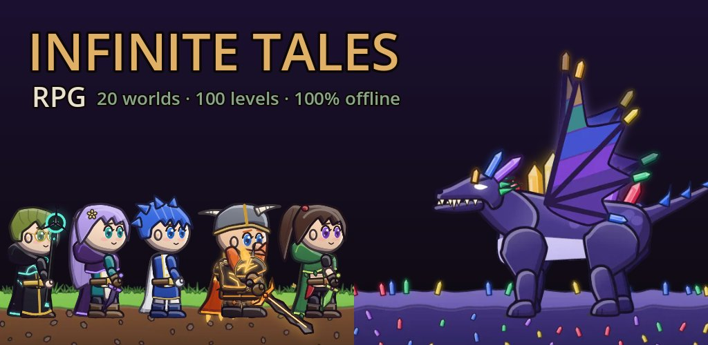
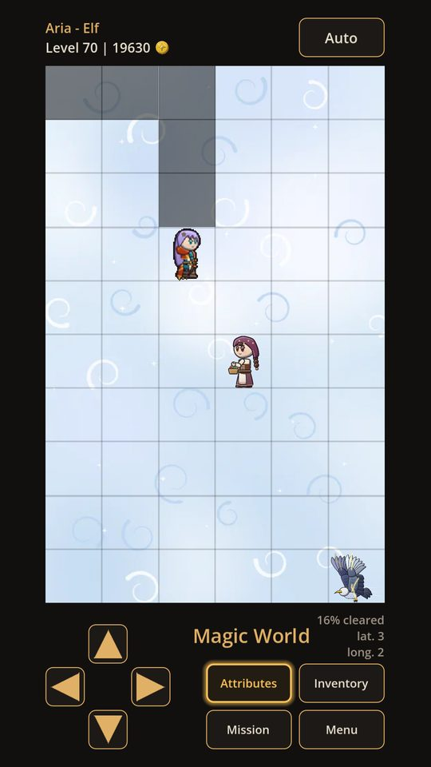
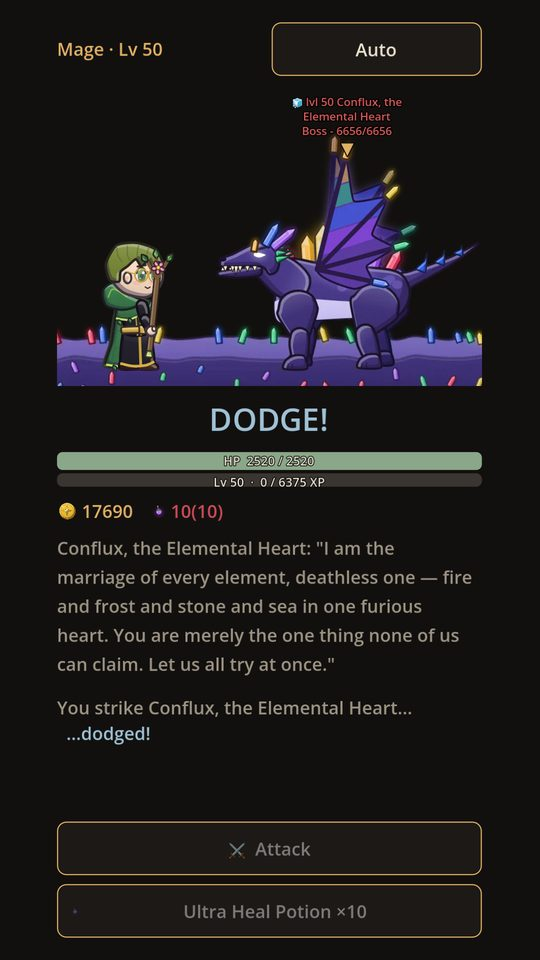
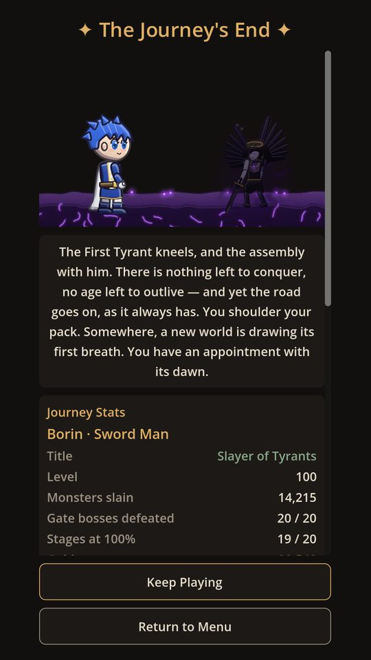

# Infinite Tales RPG

An offline dark-fantasy RPG for Android. You are the deathless wanderer: walk twenty
worlds block by block, take the mission each one hands you, and face the boss that
guards its gate.

This repository is the game's **public website**, served by GitHub Pages:

- **Site:** https://engguilherme.github.io/Infinit_Tales_Public/
- **Privacy policy:** https://engguilherme.github.io/Infinit_Tales_Public/privacy.html
- **Google Play:** coming soon (`com.engguilherme.infinitetales`)

The game's source code is kept in a separate, private repository.

## The game

- **Five classes** — Mage, Dwarf, Elf, Rogue and Sword Man, each with its own attack
  and passive skill. The armor and weapon you equip show on your hero.
- **Twenty worlds, levels 1–100** — from the Forest to the Bosses World, each with its
  own monsters, music and gate boss.
- **A mission in every world** — slay monsters, walk every block of the map or hunt
  every kind of creature, for gold, potions, Epic and Legendary sets, elemental weapons
  and backpack space.
- **Gear** — 96 sets in four rarities; weapons that burn, freeze, poison or make foes
  bleed.
- **A real ending** — beat the final boss to see your journey's stats, then keep playing
  every world with the same save.
- **Fully offline** — no account, no ads, no internet, no data collected.
- Available in English and Portuguese (Brazil).

| | | |
|---|---|---|
|  |  |  |

## Contact

Questions or problems: [enggmvieira@gmail.com](mailto:enggmvieira@gmail.com)

## Maintaining the site

**Publishing** — Settings → Pages → *Build and deployment*: **Deploy from a branch**,
branch **`main`**, folder **`/ (root)`** → Save. The site updates a minute or two after
each push to `main`.

**The privacy policy** (`privacy.html`) is the URL given to Google Play. Its text must
match the one inside the game (Configs → Privacy Policy, `privacy_body` in the game's
`i18n.gd`). If the game ever starts collecting data or going online, update both texts
and the "Last updated" date **before** releasing that version.

**When the game is live on Google Play**, open `assets/site.js` and set
`PLAY_LIVE = true` — the "Coming soon" label becomes a link to the store page.

| Path | What it is |
|---|---|
| `index.html` | The game's page (English by default, with a Português switch remembered per visitor) |
| `privacy.html` | Privacy policy (EN + pt-BR) |
| `assets/css/site.css` | Styles — the game's own colour palette |
| `assets/site.js` | Language switch and the Google Play link |
| `assets/fonts/` | Self-hosted fonts (no requests to third-party servers) + their licenses |
| `assets/img/` | Hero art, the 20 world/boss tiles, screenshots, icons, share images |
| `.nojekyll` | Tells GitHub Pages to serve the files as they are |

## License

© 2026 Guilherme. The game's art, music, screenshots and text are **all rights
reserved** — please don't reuse them without permission. The fonts Pixelify Sans and
Alegreya Sans are under the SIL Open Font License 1.1 (see `assets/fonts/`).
